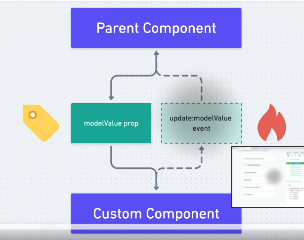

# Notes

## 03.43-using-v-model-on-custom-component



Create component with [multi-word name](https://vuejs.org/style-guide/rules-essential.html#use-multi-word-component-names).
Note: this is the so named kabob case ('hello-world-item'), all lower case and the words separated by hyphen.

Also, prefix the names with `Base`, `App` or `V` as recommended in the [Vue Style Guide](https://vuejs.org/style-guide/).

Define the `modelValue`, the `update:modelValue` update event that we emit on `@change`.

We are adding an additional label string property. Later we will learn about _component slots_ that allow passing in large strings and html to components.

```js
app.component('base-checkbox', {
  props: {
    modelValue: {
      type: Boolean,
      required: true,
    },
    label: {
      type: String
    }
  },
  emits: ['update:modelValue'],
  methods: {
    onChange() {
      this.$emit('update:modelValue', !this.modelValue);
    }
  },
  template: `<div>
    <input type="checkbox"
      :checked="modelValue"
      @change="onChange"/>
    <label>{{label}}</label>
  </div>`
});
```

Usage:

```html
        <base-checkbox
          label="Only pending tasks"
          class="mb-4 p-4 text-gray-600 text-sm font-weight-100"
          v-model="onlyPending"
        >
        </base-checkbox>
```

__Remember__: Passed `class` value gets applied to the top-most element of the component.
