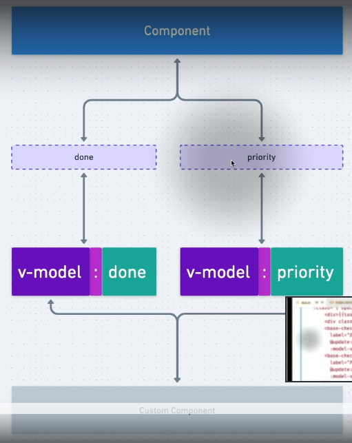

# Notes

## 03.44-multiple-v-model-bindings



Define reactive properties `done` and `priority`:

Emit updates on these properties from the _base-checkbox_. We get the value with the special `$event`. Here we are handling an event, and then passing it even further up, passing up the same value that was emitted.

```js
app.component('todo-list-item', {
  props: {
    task: {
      type: Object,
      required: true
    },
    done: Boolean,
    priority: Boolean
  },
  emits: ['update:done', 'update:priority'],
  template: `<div
    class="bg-white shadow-sm rounded-md text-gray-700 text-xs md:text-sm p-4"
    :class="{'opacity-25 line-through': task.done}">
        <div>{{task.description}}</div>
        <div class="py-4 bg-white">
        <base-checkbox class="mb-2"
          label="Done"
          @update:model-value="$emit('update:done', $event)"
          :model-value="done"></base-checkbox>
        <base-checkbox
          label="Prioritized"
          @update:model-value="$emit('update:priority', $event)"
          :model-value="priority"></base-checkbox>
      </div>
    </div>
    `
});
```

Then pass the reactive data via `v-model:propname`. The `v-model` is a shortcut for setting a prop and then listening to changes via an event.

```html
        <todo-list-item
          v-for="task in displayedTasks"
          :task="task"
          v-model:done="task.done"
          v-model:priority="task.priority"
```

Some notes:

In the _html we use kabob-case_ `@update:model-value` and in the _JavaScript we use camelCase_: `this.$emit('update:modelValue', !this.modelValue)`.

We also apply class binding in this example: `:class="{'opacity-25 line-through': task.done}"`.

Also we sort the tasks with the computed `displayedTasks`, so that the prioritized come at the top of the list:

```js
computed: {
    displayedTasks() {
      return [...this.tasks].sort(
        (a, b) => Number(b.priority) - Number(a.priority)
      )
        .filter(
          task => !this.onlyPending || !task.done
        );
    }
  },
```
