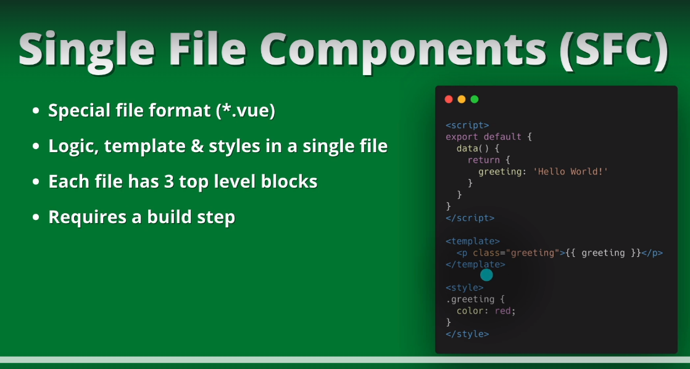

# Notes

## 04.48-single-file-components

Why Single File Components (SFC)?

- Pre-compiled templates
- Modular components
- Component scoped CSS
- Ergonomics with Composition API
- IDE Support
- HMR (Hot Module Replacement) Support

When to use SFC?

- Any non-trivial frontend (most of cases usually)
- Single-Page App (SPA)
- Static Site Generator (SSG)
