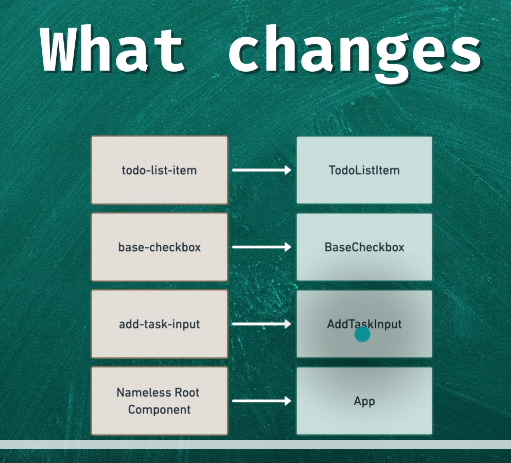
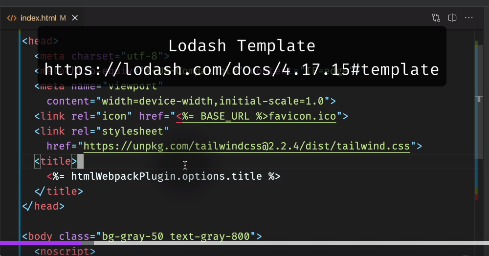

# Notes

## 04.53-moving-to-single-file-components



We create components with _PascalCase naming_. The Templates go into `<template>` tag.

Both _PascalCase_ and _kabob-case_ are interchangeable. With stick to _PascalCase for single file components (SFC)_. That's why this:

```vue
<add-task-input @added="taskAdded"></add-task-input>
```

becomes:

```vue
<AddTaskInput @added="taskAdded" />
```

Note that we also close the tag unless we are using slots.

While adjusting the `index.html` file, note the [lodash template syntax](https://lodash.com/docs/4.17.15#template) that is used by _webpack_. This file is a template that is processed by webpack:


