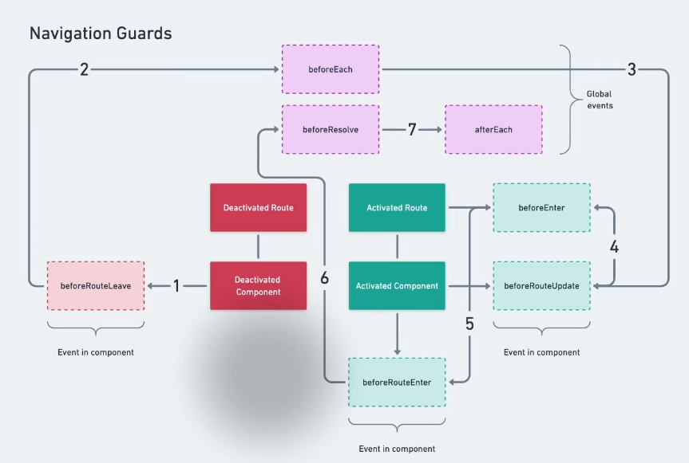
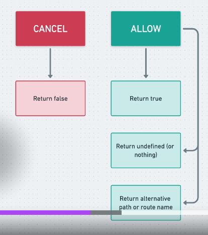

# Notes

## 05.70-navigation-guards

Guards navigation route from unauthorized access.



The most generic way is - add `beforeEach()` on the router. We need to return something to let the router what is to do:



Note: when we do not return nothing from a function it actually returns `undefined` in JavaScript.

```js
const router = createRouter({ ...

router.beforeEach((to, from) => {
  if (['login', 'home', 'about'].includes(to.name)) {
    return true;
  }

  // Redirect to login, include full path as query parameter,
  // so that we can redirect back after successful authentication
  // http://localhost:8080/#/login?redirect=/articles/2
  return { name: 'login', query: { redirect: to.fullPath } };
}

```
